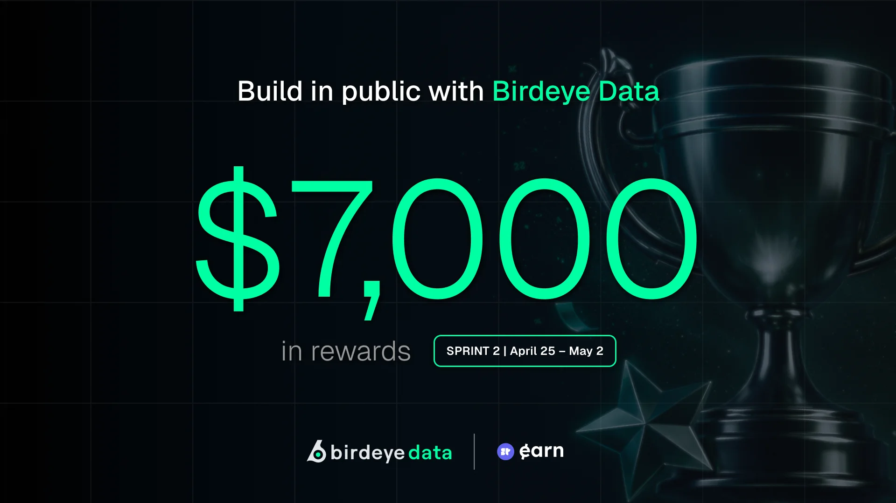
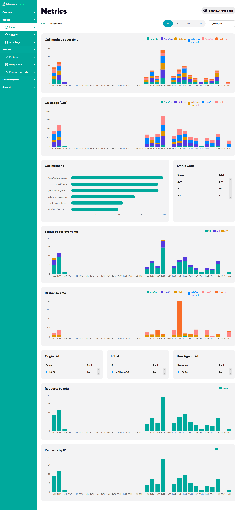
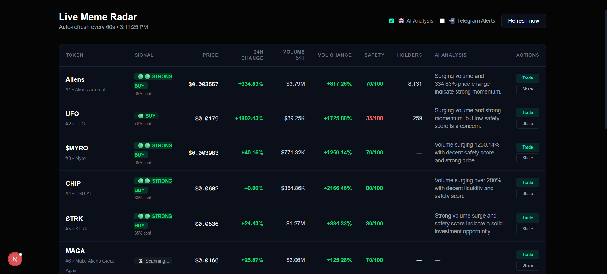
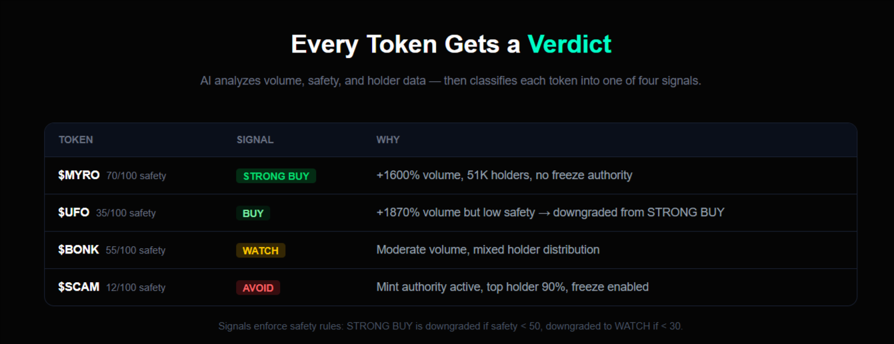
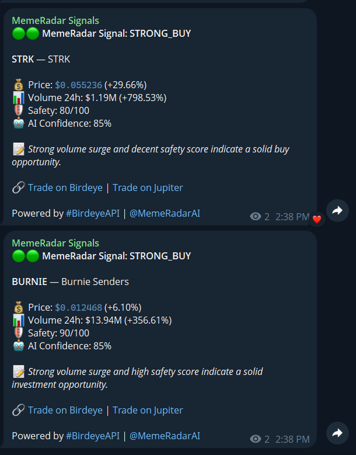

<p align="center">
  
</p>

<h1 align="center">📡 MemeRadar.ai</h1>

<p align="center">
  <strong>AI-powered meme token discovery on Solana</strong><br/>
  Real-time trending tokens · Safety scoring · AI trading signals · Telegram alerts
</p>

<p align="center">
  
  
  
  
  
  
</p>

<p align="center">
  <a href="https://memeradar3.vercel.app"><strong>🌐 Live Demo</strong></a> · 
  <a href="https://t.me/memeradar_final_signal"><strong>📲 Telegram Channel</strong></a> · 
  <a href="https://github.com/Stranger-ghope/Birdeye_Sprint3"><strong>💻 GitHub</strong></a>
</p>

---

> 🏆 **Birdeye Data 4-Week BIP Competition — Sprint 3 Submission**

---

## What It Does

MemeRadar.ai scans the Solana blockchain in real-time to surface trending and newly listed meme tokens, scores them for safety, runs AI analysis to generate trading signals, and pushes actionable alerts to Telegram — all in one dashboard.

### Pipeline

```
Birdeye API → Trending + New Listings → Security → Overview → Price → AI Analysis → Telegram Alerts
```

1. **Fetch trending tokens** via `/defi/token_trending`
2. **Cross-reference new listings** via `/defi/v2/tokens/new_listing`
3. **Safety scoring** via `/defi/token_security` with heuristic fallback
4. **Holder counts** via `/defi/token_overview`
5. **Real-time price verification** via `/defi/price`
6. **AI signal generation** via Groq (Llama 3.1) — classifies tokens as `STRONG_BUY`, `BUY`, `WATCH`, or `AVOID`
7. **Telegram alerts** — pushes BUY/STRONG_BUY signals with trade links to Birdeye & Jupiter

---

## Birdeye API Endpoints

| # | Endpoint | Purpose | Calls/Scan |
|---|---|---|---|
| 1 | `GET /defi/token_trending` | Fetch top trending tokens on Solana | 1 |
| 2 | `GET /defi/v2/tokens/new_listing` | Detect newly listed tokens | 1 |
| 3 | `GET /defi/token_security` | Mint authority, freeze, holder concentration | 2 |
| 4 | `GET /defi/token_overview` | Holder count and supply data | 5 |
| 5 | `GET /defi/price` | Real-time price verification | 2 |

**5 Birdeye endpoints · ~11 API calls per scan · Auto-refresh every 2 min**

### ✅ 140+ API Calls Verified

<p align="center">
  
</p>

---

## Features

| Feature | Description |
|---|---|
| 📡 **Live Token Feed** | Trending + new tokens refreshed every 2 minutes |
| 🛡️ **Safety Scoring** | On-chain security data with heuristic fallback |
| 👥 **Holder Data** | Real holder counts from token overview |
| 🤖 **AI Signals** | Groq-powered `STRONG_BUY` / `BUY` / `WATCH` / `AVOID` with confidence % |
| 🔗 **Trade Buttons** | One-click trade on Birdeye directly from dashboard |
| 📲 **Telegram Alerts** | Auto-push BUY signals with AI analysis + trade links |
| 📊 **API Call Tracker** | Live Birdeye call counter with 50+ proof |
| 🐦 **Share to X** | One-click sharing for any token signal |

---

## Tech Stack

| Layer | Technology |
|---|---|
| **Framework** | Next.js 14 (App Router, TypeScript) |
| **Styling** | Tailwind CSS (dark theme, neon accents) |
| **AI Engine** | Groq API (Llama 3.1 8B Instant) |
| **Alerts** | Telegram Bot API |
| **Data** | Birdeye Public API (Solana) |
| **Deployment** | Vercel |

---

## Project Structure

```
memeradar/
├── app/
│   ├── page.tsx                 # Landing page
│   ├── dashboard/page.tsx       # Live token dashboard
│   └── api/scan/route.ts        # Scan pipeline API (7-step pipeline)
├── lib/
│   ├── types.ts                 # Shared TypeScript types
│   ├── birdeye.ts               # Birdeye API client (5 endpoints)
│   ├── groq.ts                  # AI analysis (Groq/Llama)
│   ├── telegram.ts              # Telegram alert client
│   └── scorer.ts                # Safety scoring logic
├── public/
│   ├── api-call.png             # API usage proof screenshot
│   ├── birdeye.webp             # Competition banner
│   ├── dashboard.png            # Dashboard screenshot
│   ├── verdict.png              # Signal verdict screenshot
│   └── telegram.png             # Telegram alert screenshot
└── README.md
```

---

## Screenshots

### Dashboard — Live Token Radar

<p align="center">
  
</p>

### Signal Verdict — Every Token Gets Classified

<p align="center">
  
</p>

### Telegram Alerts — AI Signals with Trade Links

<p align="center">
  
</p>

---

## Getting Started

**1. Clone & install**

```bash
git clone https://github.com/Stranger-ghope/Birdeye_Sprint3.git
cd Birdeye_Sprint3
npm install
```

**2. Configure environment**

Create a `.env.local` file:

```env
NEXT_PUBLIC_BIRDEYE_API_KEY=your_birdeye_key
GROQ_API_KEY=your_groq_key
TELEGRAM_BOT_TOKEN=your_bot_token
TELEGRAM_CHAT_ID=your_chat_id
```

**3. Run locally**

```bash
npm run dev
```

Open [localhost:3000](http://localhost:3000) for the landing page, or [localhost:3000/dashboard](http://localhost:3000/dashboard) for the live radar.

---

## Author

Built by [@maineine](https://x.com/maineine) for Birdeye Data Sprint 3.

Telegram: [@Cheeseman07](https://t.me/Cheeseman07)

<p align="center">
  <code>#BirdeyeAPI</code> · <code>@birdeye_data</code> · <code>#Solana</code> · <code>#MemeTokens</code> · <code>#AI</code>
</p>
